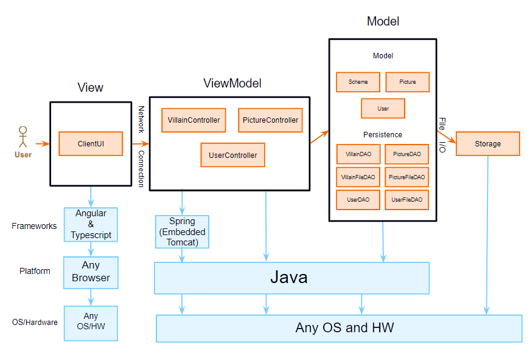
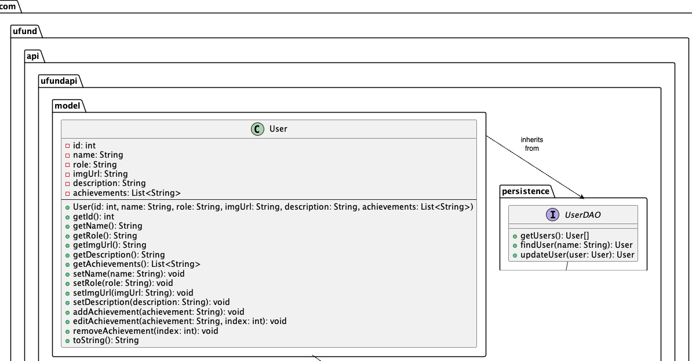
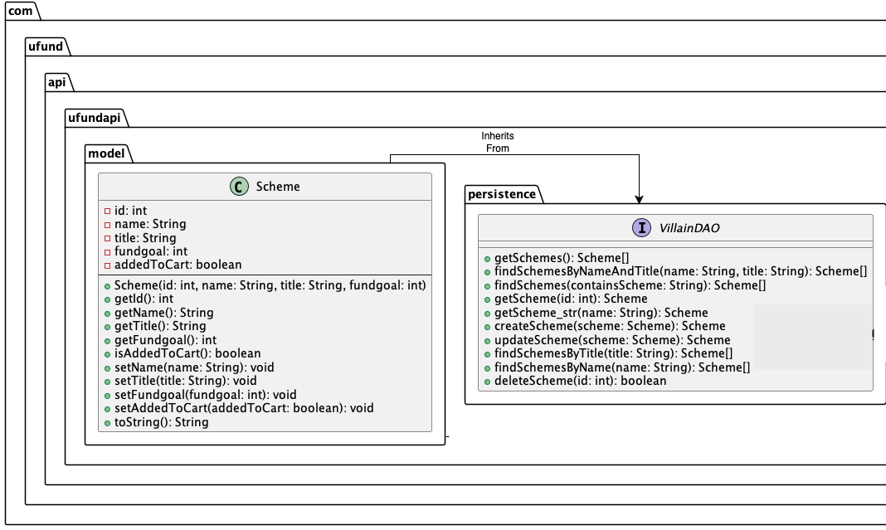

# PROJECT Design Documentation

> _The following template provides the headings for your Design
> Documentation.  As you edit each section make sure you remove these
> commentary 'blockquotes'; the lines that start with a > character
> and appear in the generated PDF in italics but do so only **after** all team members agree that the requirements for that section and current Sprint have been met. **Do not** delete future Sprint expectations._

## Team Information
* Team name: Mansfield Minions
* Team members
  * Isaac Soares
  * Nadeem Mustafa
  * Evan Kinsey
  * Jacky Chan
  * Anthony Visiko

## Executive Summary   

### Purpose
>  _**[Sprint 2 & 4]** 
Provide a very brief statement about the project and the most important user group and user goals._

OnlyVillains is a web platform dedicated to empowering villains by providing a means for supporters to contribute to their schemes. By facilitating donations and enabling villains to post schemes for funding, the platform aims to level the playing field and promote success in villainous endeavors. Open to all donors and qualified villains, OnlyVillains seeks to reshape the narrative of power and fairness in favor of the sinister cause, through donating to make a villain's scheme possible, you are funding and making villain schemes around the world a better possibility. 

### Glossary and Acronyms
> _**[Sprint 2 & 4]** Provide a table of terms and acronyms._

| Term | Definition |
|------|------------|
| SPA | Single Page Application - A web application that loads a single HTML page and dynamically updates the content as the user interacts with the app. |
| API | Application Programming Interface - A set of rules and protocols for building and interacting with software applications. |
| JSON | JavaScript Object Notation - A lightweight data-interchange format that is easy for humans to read and write and easy for machines to parse and generate.|
| DAO | Data Access Object - A design pattern used to abstract the data access logic, providing an interface for accessing data from a data source. |
| MVP | Minimum Viable Product - The basic version of a product with enough features to satisfy early users and provide feedback for future development. |

## Requirements

This section describes the features of the application.

> _In this section you do not need to be exhaustive and list every
> story.  Focus on top-level features from the Vision document and
> maybe Epics and critical Stories._

### Definition of MVP
> _**[Sprint 2 & 4]** Provide a simple description of the Minimum Viable Product._
The MVP of this onlyvillains website includes the following core features:
* Users, including helpers and U-fund Managers, can log in or out of the application. Managers can log in using the reserved username "admin," while any other username is assumed to belong to a helper or villain. Usernames must be unique.
* State of funding baskets and cupboard is persisted, ensuring continuity of user interactions across sessions.
* Helpers can view a list of needs in the cupboard.
* Search and filtering capabilities allow helpers to find specific needs.
* Administrative backend for managing users and content
* Helpers can add and remove needs from their funding basket.
* The ability to "checkout" enables helpers to commit to all needs in their funding basket.
* U-fund Managers have the authority to add, remove, and edit need data in the cupboard.
* While U-fund Managers do not have access to funding baskets, they may be granted access to certain general U-fund statistics.

### MVP Features
>  _**[Sprint 4]** Provide a list of top-level Epics and/or Stories of the MVP._
* User Account Management: Register/Login/Logout
* Scheme Catalog: Browse/Search/View schemes
* Funding Transactions: Add to cart/Checkout/Donate
* Villain Dashboard: Create/Manage schemes
* Admin Control Panel: User and Scheme management

### Enhancements
> _**[Sprint 4]** Describe what enhancements you have implemented for the project._
Villain Profile - 

#### Profiles
All users can personalize their profiles with custom pictures, achievements, and descriptions. Other users can view but not edit them. Villains' profiles are linked to their schemes for a better connection to their helpers.
* Ability to add achievements/descriptions in the profile
#### Sorting by Relevance 
All users can enhance their method of searching for villain's schemes on the cupboard by selecting search by relevance. This will reveal to a user the most villainous schemes, by cross tagging strings in the scheme title that contain the most villainous actions to be at the top of the given results. 
* Ability to sort schemes by text of titles with the most villainous words. 

## Application Domain

This section describes the application domain.

> _**[Sprint 2 & 4]** Provide a high-level overview of the domain for this application. You
> can discuss the more important domain entities and their relationship to each other._

Domain Entities
* Evil Basket: This entity is a container that holds a collection of schemes added from a Helper or Villain to be Checked-out.
* Schemes: This is an entity that represents a plan of malicious purpose, it includes the name of the villain, the scheme's name and funding goal.
* Evil Cupboard: This entity is a storage location for all the schemes in the system as well as user displays such as the search bar, dashboard per role of user, cart(Evil Basket), and profile.
* Manager: This is a type of user with access who reviews submitted schemes, manages Evil Baskets, and has full access to the Evil Cupboard.
* Villain: This is a type of user who can submit schemes to be funded and have custom profile components such as a main profile and description alongside achievements.
* Helper: This is a type of user who can search schemes and check them out in the Evil Basket who has a basic profile. 
* Server: This entity is the backend system that stores information about users, schemes, Evil Baskets, and other aspects of the system.
* File: This entity is the files on the server that store the data used by the system.
* User: This is the base class for all roles in the server, containing the features of a username, description, and profile. 
* Login: This entity is the front page entrance on the ui, which takes the name of a villain, helper or manager to then log in as. 

Relationship 
* Manager adds/removes schemes to/from Evil Basket: A manager can add schemes to and remove schemes from Evil Baskets.
* Manager has all schemes in Evil Cupboard: A manager has all the schemes displayed in the Evil Cupboard.
* Manager checks schemes: A manager checks schemes.
* Manager/Villain/Helper identifies with username: All three users have usernames that they use to identify themselves with the system.
* Scheme is a type of need: A scheme can be viewed by users and display the background information about it.
* Villain submits schemes: Villains can submit schemes to be funded.
* Helper searches through schemes: A Helper can search through schemes.
* Helper checks out Evil Basket: A Helper can checkout schemes in their Evil Basket to fund. 
* Evil Basket has schemes: An Evil Basket contains Schemes chosen by a Helper or Villain.
* Server saves to/loads from File: The server saves information to files and loads information from files.
* Villains/Helpers/Managers have a profile: all users have a profile that can be viewed to find out general information about a user, Villain profiles' have special features to stand out the schemes they want funded. 
* Login directs to Evil Cupboard: Once a successful login is complete, a user can be expected to be displayed the cupboard showing the components they're allowed to interact with based on role restrictions. 

## Architecture and Design

This section describes the application architecture.

### Summary

The following Tiers/Layers model shows a high-level view of the webapp's architecture. 
**NOTE**: detailed diagrams are required in later sections of this document.

The web application is built using the Model–View–ViewModel (MVVM) architecture pattern. 

The Model stores the application data objects including any functionality to provide persistence. 

The View is the client-side SPA built with Angular utilizing HTML, CSS and TypeScript. The ViewModel provides RESTful APIs to the client (View) as well as any logic required to manipulate the data objects from the Model.

Both the ViewModel and Model are built using Java and Spring Framework. Details of the components within these tiers are supplied below.

### Overview of User Interface

This section describes the web interface flow; this is how the user views and interacts with the web application.

> _Provide a summary of the application's user interface.  Describe, from the user's perspective, the flow of the pages in the web application._

As a user access's our website, they are first introduced with a login page. Once a login is successful, a user is on the cupboard, in short the home-page for OnlyVillains. This page will display for the user certain buttons depending on permissions the user's role has and does not have. All users can see all schemes, and search + filter schemes accordingly. All users can additionally click on a scheme to show the details of the scheme, and logout whenever. They can all also edit their profile in the dashboard component from the cupboard.

A Helper and Villain(if he's in a helping mood- can't fund his own scheme of course) will have the option to add an item to the evil basket(cart) once viewing the scheme details of a Villain's scheme from schemes from the Cupboard once logged in. The evil basket can then be accessed from the cupboard, where the specified users' can then add checkout and donate to an evil scheme. 

Villain's and Managers(Admin) will have the option to access special dashboard components from the cupboard that a User doesn't have after logged in. A Villain and Manager can edit schemes from their dashboard page when clicked. A Manager can remove or edit any scheme, while also being able to add one, while a Villain can edit their own schemes, and add new schemes of their own. 

All User's have the ability to access the cupboard again when they click on the top title " !!! CLICK FOR OUR VILLAINS !!! " when logged in. 

### View Tier
> _**[Sprint 4]** Provide a summary of the View Tier UI of your architecture.
> Describe the types of components in the tier and describe their
> responsibilities.  This should be a narrative description, i.e. it has
> a flow or "story line" that the reader can follow._

The View Tier, built as a SPA, provides a dynamic and responsive user experience. Components include pages for user registration, scheme browsing, and account management, with calls to the ViewModel for data.

Let's say you are a user, a helper particularly. Just being on the site shows the app component. This acts as a container for the rest of the site, containing the header and a routing module that shows other components.

First you would log in. This interacts with the first component : the login component. This contains the entire login page, and handles logging in as well as collecting the user's information for permisions across the site. If you enter an incorrect login you stay at the login page, but if you enter a correct login you continue to the dashboard.

Once you are logged in the app component shows the header, the profile bar component the dashboard component and the scheme search component. The dashboard component is beneath it, and the header redirects to the dashboard. The dashboard component is also contained within the routing module, through with other parts of the page are displayed. The dashboard component displays a list of available schemes, their titles, associated villain names and prices, as well as a drop down menu to sort them by.

Right above the dashboard is the scheme search component. This allows you to input a phrase to search for, and lists a bunch of schemes that contain that string in either their villain name or their title. 

The profile bar component sits outside of the routing module and like the header appears on every page. This has options for navigating the website, including the link to the profile component, a link to the dashboard component if you are a helper (which is a link to the cupboard component if you are not a helper), a logout button that takes you back to the login page and a link to the cart component if you are not an admin.

Let's say you want to edit your profile. You then click on the profile bar component to take you to the profile component. The profile component shows your profile details, including your profile picture, your description and your achievements, as well as allowing you to edit them. Once you are done, you can navigate away using the profile bar component. 

Lets say you then want to donate to a few schemes. You navigate to the dashboard and click on a scheme. This brings you to the scheme detail component. This shows details about the scheme, allowing you to edit them if you are either the villain who owns the scheme or an admin. This shows an add to cart button instead if you are a helper, or a villain who does not own this scheme.

After adding a few schemes to your cart, you want to check out. You go to the profile bar component and click the cart component link. This brings you to the cart component, where the cart and checkout is handled. The cart component shows all the schemes you have added to your cart, allowing you to enter a donation amount that is at least 1 and at most the schemes fund goal. You can also remove an item from your cart here. Once you have filled in an amount for all items in your cart, you can hit checkout, and the amounts get donated to the schemes you selected.

Now, instead of being a helper, let's say instead that you are a villain. You log in the same way, and see the dashboard. Suppose you want to edit an existing scheme, or create a scheme. You go to the profile bar component and click the cupboard link. The cupboard component shows the schemes that you added to the website, and allows you to navigate to them. If you were an admin, it would allow you to edit all of the schemes on the website. Whether you were and admin or villain it would also allow you to enter information for an entirely new scheme. It would also allow you to entirely remove a scheme.

> _**[Sprint 4]** You must  provide at least **2 sequence diagrams** as is relevant to a particular aspects 
> of the design that you are describing.  (**For example**, in a shopping experience application you might create a 
> sequence diagram of a customer searching for an item and adding to their cart.)
> As these can span multiple tiers, be sure to include any relevant HTTP requests from the client-side to the server-side 
> to help illustrate the end-to-end flow._

> _**[Sprint 4]** To adequately show your system, you will need to present the **class diagrams** where relevant in your design. Some additional tips:_
 >* _Class diagrams only apply to the **ViewModel** and **Model** Tier_
>* _A single class diagram of the entire system will not be effective. You may start with one, but will need to break it down into smaller sections to account for requirements of each of the Tier static models below._
 >* _Correct labeling of relationships with proper notation for the relationship type, multiplicities, and navigation information will be important._
 >* _Include other details such as attributes and method signatures that you think are needed to support the level of detail in your discussion._

### ViewModel Tier
Let's take a look at the ViewModel Tier, the bridge between the View and Model Tiers.

When a user interacts with our website, they're engaging with the View Tier. They might request information, like details about a villain's scheme or a user's profile. This is where the ViewModel Tier steps in.

The ViewModel Tier takes these requests and translates them into commands for the Data Access Objects (DAOs) in the Model Tier. These DAOs perform the necessary CRUD operations (Create, Read, Update, & Delete) to fetch or manipulate the data.

#### Meet the Controllers

Let's introduce the key players in the ViewModel Tier: the Controllers.

First up, we have the Villain Controller. This controller is the mastermind behind managing our villains' schemes. It directs the VillainDAO to perform operations such as creating a new villain with `createVillain()`, fetching villain details with `getVillain()`, or updating a villain's information with `updateVillain()`.

Next, we have the User Controller. This controller is the guardian of our user data. It directs the UserDAO to handle operations related to our users, who could be regular users, villains, or even the admin. It can fetch user details with `getUsers()`, find a specific user with `findUser()`, or update a user's information with `updateUser()`.

Finally, we have the Picture Controller. This controller is the curator of our users' profile pictures. It directs the PictureDAO to fetch profile pictures from storage and uses the UserDAO to update a user's assigned profile picture when a new one is chosen. It can fetch a picture with `getPicture()`, find a picture by name with `getPictureByName()`, or change a user's assigned picture with `changeUserPicture()`.

> _**[Sprint 4]** Provide a summary of this tier of your architecture. This
> section will follow the same instructions that are given for the View
> Tier above._

> _At appropriate places as part of this narrative provide **one** or more updated and **properly labeled**
> static models (UML class diagrams) with some details such as critical attributes and methods._
> 

### Model Tier
- Scheme: Logic for a Scheme object 
- VillainDAO: Interface for VillainFileDAO
- VillainFileDAO: Logic to get and manipulate data in villains.json
- User: Logic for a User object, used for log in
- UserDAO: Interface for UserFileDAO
- UserFileDAO: Logic to get data in users.json
- Picture: Logic for a Picture object, stores the picture's name and byte string of data
- PictureDAO: Interface for PictureFileDAO
- PictureFileDAO: Logic to get and save pictures into the data/pictures folder

> _**[Sprint 2, 3 & 4]** Provide a summary of this tier of your architecture. This
> section will follow the same instructions that are given for the View
> Tier above._

* The Model tier represents the business logic and data access layer of the application. It's responsible for managing data models like Scheme and User, defining interfaces for data access like VillainDAO and UserDAO, and implementing concrete data access logic like VillainFileDAO and UserFileDAO.
* Here's a breakdown of its functionalities:
* Data Modeling:
The Scheme and User classes represents the core data structures of the application. These classes encapsulate the attributes and behaviors associated with a scheme or a user.
* Data Access Abstraction:
The VillainDAO,User DAO and Picture DAO interfaces define contracts for accessing and manipulating scheme and user data. This separation allows loose coupling and easier implementation changes without affecting dependent parts of the application.
* Data Access Implementation:
The VillainFileDAO, UserFileDAO and Picture DAO classes implement the data access logic specific to the JSON files. These classes handle reading from and writing to the respective JSON files villains.json and users.json.

> _At appropriate places as part of this narrative provide **one** or more updated and **properly labeled**
> static models (UML class diagrams) with some details such as critical attributes and methods._

## OO Design Principles

- Single Responsibility: Each class in our architecture has a clear and singular purpose; for instance, the ViewModel solely manages the presentation logic, while the Model handles data manipulation and storage. Each component in our system is dedicated to a single aspect of the application: Controllers manage HTTP request handling and delegate business operations, Models encapsulate the application data, and DAOs provide a specific interface for persistent data storage and retrieval. []

- Law of Demeter: Objects interact with closely-related neighbors only, reducing the ripple effects of changes and promoting a more modular and maintainable design. For example, UserController should interact only with User and UserDAO, not with any deeper components within UserDAO.
- 

- Dependancy Inversion: Dependancy inversion is a method of loosening coupling between objects. In essence,
instead of depending on a specific object, a class depends on interfaces or abstract classes, so that
other implementations may be provided. A common method in which this is done is dependancy
injection, in which a higher level class that uses a lower level class instantiates classes beneath the
lower class and inserts them into it. For example, our Villain Controller uses a VillainDAO interface, into which the VillainFileDAO is injected using Spring.

- Controller: A controller is a way of separating the UI and the system, often used in the
Model-View-Controller framework. What a controller does is it receives the system messages
(button clicks mostly) and it tells the model (the data storage and management) to update, or do
something based on that. This allows the UI to just handle updating itself when the model
updates, and allows the model to work without requiring direct interference from the UI. For example, we use 3 different controllers to interface with 3 different DAOs. Each of them handles the CURL calls and uses the DAO as the model, grabbing data from it and returning it.

- Open/Closed: Our design allows for extension through inheritance or composition without modifying existing code, promoting code reuse and ensuring stability.

- Pure Fabrication: When necessary, we introduce classes that do not represent real-world concepts but are created solely to enable separation of concerns and enhance maintainability. For example, introducing classes like PictureService are essential for organizing and managing functionality within the application. The PictureService class, for instance, encapsulates image-related operations, such as uploading, retrieving, and handling errors, promoting separation of concerns and maintainability in the codebase.
- 

- Polymorphism: Through interfaces and inheritance, our design allows objects of different types to be treated uniformly, promoting flexibility and extensibility in handling various data types and behaviors.
- 

- Information Expert: Assigning functionalities based on information ownership. For example, the Cart class would include methods like `getCart()` and `checkout()` because it has the property `cart: CartItem[]`, the information about what schemes are inside the user's cart.
- 

- High Cohesion: This aligns with the way entities relate in the ER diagrams. Classes representing entities Manager and Funding Basket, Helper and Scheme are together to achieve specific functionalities like creating funding baskets, submitting schemes. Our User and Scheme classes demonstrate high cohesion by encapsulating all the necessary properties and behaviors of their respective domain entities, ensuring that related data and functions are grouped together for specific business functionalities. []

- Low Coupling: Minimizing dependencies between classes is crucial in an OO design. Classes like Manager shouldn't cause major changes in another class like Funding Basket.

> _**[Sprint 2, 3 & 4]** Will eventually address up to **4 key OO Principles** in your final design. Follow guidance in augmenting those completed in previous Sprints as indicated to you by instructor. Be sure to include any diagrams (or clearly refer to ones elsewhere in your Tier sections above) to support your claims._

> _**[Sprint 3 & 4]** OO Design Principles should span across **all tiers.**_

## Static Code Analysis/Future Design Improvements

Several methods within our API have been identified as prime candidates for conversion to static methods. This recommendation arises from their independence from instance variables, indicating a lack of side effects and rendering them ideal for static typing. By refactoring these methods to static, we aim to enhance maintainability and predictability in future iterations. This adjustment not only fosters a cleaner codebase but also bolsters performance by mitigating the overhead associated with object creation and garbage collection.

Inconsistencies in the utilization of built-in formatting options for string construction have been noted, potentially leading to errors and decreased code readability and maintainability. To address this, future refactoring endeavors will focus on standardizing string formatting through the utilization of tools such as String.format(). This standardized approach will significantly enhance code readability, making it easier to maintain and debug.

The presence of several unused fields across different classes contributes to codebase clutter, hindering efficiency and potentially causing confusion. To mitigate this issue, future considerations involve the removal of all unused fields, following a thorough review process to ensure their redundancy. Furthermore, automation of this cleanup process in future sprints will enable continuous codebase refinement.

Within our UI code, the existence of empty constructors devoid of any functionality has been identified. These constructors, while seemingly linked to specific requirements, serve no meaningful purpose and contribute to codebase complexity. Future refactoring efforts will focus on eliminating these empty constructors to streamline the codebase, thereby eliminating confusion and ensuring the maintenance of only meaningful code segments.

## Testing
> _This section will provide information about the testing performed
> and the results of the testing._

### Acceptance Testing
> _**[Sprint 2 & 4]** Report on the number of user stories that have passed all their
> acceptance criteria tests, the number that have some acceptance
> criteria tests failing, and the number of user stories that
> have not had any testing yet. Highlight the issues found during
> acceptance testing and if there are any concerns.
    * User Stories that Passed All Tests:
* In Sprint 2, all the user stories listed passed their acceptance criteria.
* In Sprint 4, all user stories except for two passed all of their acceptance criteria.
    * User Stories with Some Tests Failing:
* In Sprint 2, there were no user stories with failing acceptance criteria.
* In Sprint 4, there were two instances of acceptance criteria failing related to the role not being displayed for a user after logging in.
    * User Stories Not Tested:
* There are no user stories that have not been tested in both sprints.
    * Issues Highlighted During Acceptance Testing:
* The main issue highlighted in Sprint 4 was the missing role information in the session storage 
* and the profile view after a user logs in. This issue was noted twice, however this was due to the
* name of the user roles deleted in the css.

### Unit Testing and Code Coverage

> _**[Sprint 4]** Discuss your unit testing strategy. Report on the code coverage
> achieved from unit testing of the code base. Discuss the team's
> coverage targets, why you selected those values, and how well your
> code coverage met your targets._

Our unit testing strategy revolved around ensuring robust code coverage to minimize the likelihood of bugs and enhance code quality. We utilized Jacoco for generating unit testing reports, integrating well with our Maven build process.

Coverage Targets:
Throughout the sprint, our team aimed for a minimum code coverage threshold of 90%. We selected this value based on industry best practices and that being the threshold requirements for each sprint. Achieving this level of coverage helped ensure sufficient testing of critical components while still developing. 

Performance Against Targets:
We're pleased to report that our code coverage for Sprint 4 surpassed our expectations. We achieved a commendable 99% coverage combined, indicating thorough testing of our codebase. This instills stability of our application.
>_**[Sprint 2 & 4]** **Include images of your code coverage report.** If there are any anomalies, discuss
> those._
Anomalies - Sprint 4:
As shown from our latest Code Coverage earlier, we didn't have any major Anomalies or missed test cases. However, we did miss a few branches in our persistence tier.

 Inside VillainFileDAO in persistence, we only see a 89% coverage, which is due to the Elements below not covering all branches:

Specifically, within the VillainFileDAO class in the persistence tier, we observed that the findSchemesbyNameAndTitle(String, String) and load() methods did not achieve full coverage.
The lack of coverage in these methods can be attributed to:
1. findSchemesbyNameAndTitle(String, String):
While this method performs filtering based on the provided name and title parameters, the testing didn't cover all possible scenarios, especially edge cases.
2. load():
Although this method is crucial for initializing the schemes map from the JSON file, the coverage analysis revealed that certain code paths were not exercised during testing. This indicates gaps in our testing strategy, particularly in handling file I/O exceptions or unexpected file formats.
Anomalies - Sprint 2:

Shown in the code coverage above, there were issues in the persistence tier with a low score of 85% coverage. The main cause for this low tier was the small coverage we attained in the elements below:

1. createScheme(Scheme scheme):
The method performed checks to ensure uniqueness based on both the scheme ID and name. However, our tests may not have accounted for scenarios where a scheme with the same ID and name already exists. As a result, certain branches handling these scenarios might not have been fully exercised during testing, leading to lower coverage.
2. findSchemesByName(String name):
While the method aims to retrieve schemes based on name, paths related to name matching and filtering simultaneously, may not have been thoroughly tested.not covering various permutations of input names and edge cases.

## Ongoing Rationale
>_**[Sprint 1, 2, 3 & 4]** Throughout the project, provide a time stamp **(yyyy/mm/dd): Sprint # and description** of any _**major**_ team decisions or design milestones/changes and corresponding justification._

* **(2024/2/1) First Sprint and Demo Complete!** Officially finishing our first demo video and sprint, we are all relieved and adjusted now to the workload. The way we filmed the demo was a intersting choice, that can definitely be improved in the future with perhaps a larger time frame, as well as going into more details. This spring has set up our backend with the necessary DAO files and services we need right now, we might however have to add some in the future. This spring is one for the books and hopefully our next ones will be as smooth as this one. 

* **(2024/3/7) Sprint 2 Login Start** Currently have one type of user: user. It only contains id and name right now. Maybe in the future every user will have a permissions identifier we recognize on log-in and give different views from that.
* **(2024/3/12 Sprint 2 Login Roles)** Users now have a "role". Unlike other websites, we will not redirect different roles (Helper, Villain, Admin) to different dashboards. Instead, we will show certain components based on what their role should be able to do.

* **(2024/3/20 Sprint 3 Sort Filtering Starts)** Currently implementing two basic components to filter schemes on the cupboard for users, from high to low and low to high. The quantities in parameter for the low and high adjusting are the fund goals for each villain's scheme, with low being the lowest fund goal and highest being the highest fund goal. For the enhancement will try to add a sort by relevance, but still trying to figure out how we'll do that. 

* **(2024/3/20 Sprint 3 Sort Filtering Ends)** We have finished implementing how the sort filter works, we now have a completed low-high high-low and relevance. How me(Isaac) decided to implement relevance was to search for words in scheme titles with the most villainous attributes, and rank those strings by level of evilness to then be at the utmost top of the schemes in the cupboard. We agreed to go with this instead of ranking the villains on other components, such as their achievements and descriptions because schemes data(villain.json), such as name, villain, and fund goal was a separate json file than the villains components(users.json) that contained the achievements and descriptions of villains. Doing it this way was the best in the time crunch we had, as well as a way to not change the backend too much with how the components were being stored separately. 

* **(2024/3/29 Sprint 3 Design Website Starts )** As approaching the task of making our ui more attractive and better for users, we first drafted on how we would create the websites' designs. The group had some advanced ideas such as using figma, and other online html editors to make different website components. However, realizing the simplicity of this project was important to highlight that such a advanced tool wouldn't be needed, and doing html & css by hand would be more appropriate. We then created a mock draft on pen and paper of the ui design alongside a color theme,and are now deciding to implement with the help of Nadeem's html background. 

* **(2024/4/05 Sprint 3 Design Website Ends )** With the website's design finally complete with Nadeem and Isaac implementing the ui they drew out, we have an amazing website that shows a cool villainous layout that matches the theme of this api project. We will further discuss future implementations based on the feedback we get for this sprint, but as of now we are adequate with the coloring and format style we've chosen. 

* **(2024/4/16 Sprint 4 Final Wrap Up )** Just finishing Spring 4 has given us time to reflect and ponder on this group project, we will all miss working with eachother and the amazing website we built. Going into this sprint we decided to make quick slides with features that will grab our audiences, with lots of visuals(diagrams) and fun prompts and trivia at the end of our slide we hope to portray the fun and insightful information we learned on this journey to our fellow classmates. 
