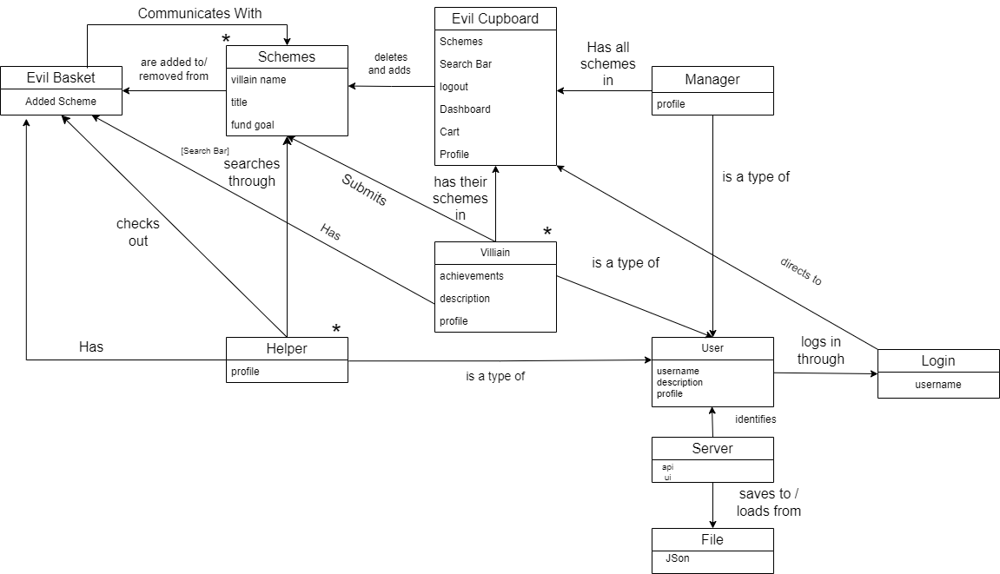

# PROJECT Design Documentation

> _The following template provides the headings for your Design
> Documentation.  As you edit each section make sure you remove these
> commentary 'blockquotes'; the lines that start with a > character
> and appear in the generated PDF in italics but do so only **after** all team members agree that the requirements for that section and current Sprint have been met. **Do not** delete future Sprint expectations._

## Team Information
* Team name: Mansfield Minions
* Team members
  * Isaac Soares
  * Nadeem Mustafa
  * Evan Kinsey
  * Jacky Chan
  * Anthony Visiko

## Executive Summary   

### Purpose
>  _**[Sprint 2 & 4]** 
Provide a very brief statement about the project and the most important user group and user goals._

OnlyVillains is a web platform dedicated to empowering villains by providing a means for supporters to contribute to their schemes. By facilitating donations and enabling villains to post schemes for funding, the platform aims to level the playing field and promote success in villainous endeavors. Open to all donors and qualified villains, OnlyVillains seeks to reshape the narrative of power and fairness in favor of the sinister cause, through donating to make a villain's scheme possible, you are funding and making villain schemes around the world a better possibility. 

### Glossary and Acronyms
> _**[Sprint 2 & 4]** Provide a table of terms and acronyms._

| Term | Definition |
|------|------------|
| SPA | Single Page Application - A web application that loads a single HTML page and dynamically updates the content as the user interacts with the app. |
| API | Application Programming Interface - A set of rules and protocols for building and interacting with software applications. |
| JSON | JavaScript Object Notation - A lightweight data-interchange format that is easy for humans to read and write and easy for machines to parse and generate.|
| DAO | Data Access Object - A design pattern used to abstract the data access logic, providing an interface for accessing data from a data source. |
| MVP | Minimum Viable Product - The basic version of a product with enough features to satisfy early users and provide feedback for future development. |

## Requirements

This section describes the features of the application.

> _In this section you do not need to be exhaustive and list every
> story.  Focus on top-level features from the Vision document and
> maybe Epics and critical Stories._

### Definition of MVP
> _**[Sprint 2 & 4]** Provide a simple description of the Minimum Viable Product._
The MVP of this onlyvillains website includes the following core features:
* Users, including helpers and U-fund Managers, can log in or out of the application. Managers can log in using the reserved username "admin," while any other username is assumed to belong to a helper or villain. Usernames must be unique.
* State of funding baskets and cupboard is persisted, ensuring continuity of user interactions across sessions.
* Helpers can view a list of needs in the cupboard.
* Search and filtering capabilities allow helpers to find specific needs.
* Administrative backend for managing users and content
* Helpers can add and remove needs from their funding basket.
* The ability to "checkout" enables helpers to commit to all needs in their funding basket.
* U-fund Managers have the authority to add, remove, and edit need data in the cupboard.
* While U-fund Managers do not have access to funding baskets, they may be granted access to certain general U-fund statistics.

### MVP Features
>  _**[Sprint 4]** Provide a list of top-level Epics and/or Stories of the MVP._
* User Account Management: Register/Login/Logout
* Scheme Catalog: Browse/Search/View schemes
* Funding Transactions: Add to cart/Checkout/Donate
* Villain Dashboard: Create/Manage schemes
* Admin Control Panel: User and Scheme management

### Enhancements
> _**[Sprint 4]** Describe what enhancements you have implemented for the project._

#### Profiles
All users can personalize their profiles with custom pictures, achievements, and descriptions. Other users can view but not edit them. Villains' profiles are linked to their schemes for a better connection to their helpers.

* Ability to add achievements/descriptions in the profile

## Application Domain

This section describes the application domain.

> _**[Sprint 2 & 4]** Provide a high-level overview of the domain for this application. You
> can discuss the more important domain entities and their relationship to each other._

Domain Entities
* Evil Basket: This entity is a container that holds a collection of schemes added from a Helper or Villain to be Checked-out.
* Schemes: This is an entity that represents a plan of malicious purpose, it includes the name of the villain, the scheme's name and funding goal.
* Evil Cupboard: This entity is a storage location for all the schemes in the system as well as user displays such as the search bar, dashboard per role of user, cart(Evil Basket), and profile.
* Manager: This is a type of user with access who reviews submitted schemes, manages Evil Baskets, and has full access to the Evil Cupboard.
* Villain: This is a type of user who can submit schemes to be funded and have custom profile components such as a main profile and description alongside achievements.
* Helper: This is a type of user who can search schemes and check them out in the Evil Basket who has a basic profile. 
* Server: This entity is the backend system that stores information about users, schemes, Evil Baskets, and other aspects of the system.
* File: This entity is the files on the server that store the data used by the system.
* User: This is the base class for all roles in the server, containing the features of a username, description, and profile. 
* Login: This entity is the front page entrance on the ui, which takes the name of a villain, helper or manager to then log in as. 

Relationship 
* Manager adds/removes schemes to/from Evil Basket: A manager can add schemes to and remove schemes from Evil Baskets.
* Manager has all schemes in Evil Cupboard: A manager has all the schemes displayed in the Evil Cupboard.
* Manager checks schemes: A manager checks schemes.
* Manager/Villain/Helper identifies with username: All three users have usernames that they use to identify themselves with the system.
* Scheme is a type of need: A scheme can be viewed by users and display the background information about it.
* Villain submits schemes: Villains can submit schemes to be funded.
* Helper searches through schemes: A Helper can search through schemes.
* Helper checks out Evil Basket: A Helper can checkout schemes in their Evil Basket to fund. 
* Evil Basket has schemes: An Evil Basket contains Schemes chosen by a Helper or Villain.
* Server saves to/loads from File: The server saves information to files and loads information from files.
* Villains/Helpers/Managers have a profile: all users have a profile that can be viewed to find out general information about a user, Villain profiles' have special features to stand out the schemes they want funded. 
* Login directs to Evil Cupboard: Once a successful login is complete, a user can be expected to be displayed the cupboard showing the components they're allowed to interact with based on role restrictions. 

## Architecture and Design

This section describes the application architecture.

### Summary

The following Tiers/Layers model shows a high-level view of the webapp's architecture. 
**NOTE**: detailed diagrams are required in later sections of this document.

The web application is built using the Model–View–ViewModel (MVVM) architecture pattern. 

The Model stores the application data objects including any functionality to provide persistence. 

The View is the client-side SPA built with Angular utilizing HTML, CSS and TypeScript. The ViewModel provides RESTful APIs to the client (View) as well as any logic required to manipulate the data objects from the Model.

Both the ViewModel and Model are built using Java and Spring Framework. Details of the components within these tiers are supplied below.

### Overview of User Interface

This section describes the web interface flow; this is how the user views and interacts with the web application.

> _Provide a summary of the application's user interface.  Describe, from the user's perspective, the flow of the pages in the web application._

As a user access's our website, they are first introduced with a login page. Once a login is successful, a user is on the cupboard, in short the home-page for OnlyVillains. This page will display for the user certain buttons depending on permissions the user's role has and does not have. All users can see all schemes, and search + filter schemes accordingly. All users can additionally click on a scheme to show the details of the scheme, and logout whenever. They can all also edit their profile in the dashboard component from the cupboard.

A Helper and Villain(if he's in a helping mood- can't fund his own scheme of course) will have the option to add an item to the evil basket(cart) once viewing the scheme details of a Villain's scheme from schemes from the Cupboard once logged in. The evil basket can then be accessed from the cupboard, where the specified users' can then add checkout and donate to an evil scheme. 

Villain's and Managers(Admin) will have the option to access special dashboard components from the cupboard that a User doesn't have after logged in. A Villain and Manager can edit schemes from their dashboard page when clicked. A Manager can remove or edit any scheme, while also being able to add one, while a Villain can edit their own schemes, and add new schemes of their own. 

All User's have the ability to access the cupboard again when they click on the top title " !!! CLICK FOR OUR VILLAINS !!! " when logged in. 

### View Tier
> _**[Sprint 4]** Provide a summary of the View Tier UI of your architecture.
> Describe the types of components in the tier and describe their
> responsibilities.  This should be a narrative description, i.e. it has
> a flow or "story line" that the reader can follow._

The View Tier, built as a SPA, provides a dynamic and responsive user experience. Components include pages for user registration, scheme browsing, and account management, with calls to the ViewModel for data.

> _**[Sprint 4]** You must  provide at least **2 sequence diagrams** as is relevant to a particular aspects 
> of the design that you are describing.  (**For example**, in a shopping experience application you might create a 
> sequence diagram of a customer searching for an item and adding to their cart.)
> As these can span multiple tiers, be sure to include an relevant HTTP requests from the client-side to the server-side 
> to help illustrate the end-to-end flow._

> _**[Sprint 4]** To adequately show your system, you will need to present the **class diagrams** where relevant in your design. Some additional tips:_
 >* _Class diagrams only apply to the **ViewModel** and **Model** Tier_
>* _A single class diagram of the entire system will not be effective. You may start with one, but will need to break it down into smaller sections to account for requirements of each of the Tier static models below._
 >* _Correct labeling of relationships with proper notation for the relationship type, multiplicities, and navigation information will be important._
 >* _Include other details such as attributes and method signatures that you think are needed to support the level of detail in your discussion._

### ViewModel Tier
Let's take a look at the ViewModel Tier, the bridge between the View and Model Tiers.

When a user interacts with our website, they're engaging with the View Tier. They might request information, like details about a villain's scheme or a user's profile. This is where the ViewModel Tier steps in.

The ViewModel Tier takes these requests and translates them into commands for the Data Access Objects (DAOs) in the Model Tier. These DAOs perform the necessary CRUD operations (Create, Read, Update, & Delete) to fetch or manipulate the data.

#### Meet the Controllers

Let's introduce the key players in the ViewModel Tier: the Controllers.

First up, we have the Villain Controller. This controller is the mastermind behind managing our villains' schemes. It directs the VillainDAO to perform operations such as creating a new villain with `createVillain()`, fetching villain details with `getVillain()`, or updating a villain's information with `updateVillain()`.

Next, we have the User Controller. This controller is the guardian of our user data. It directs the UserDAO to handle operations related to our users, who could be regular users, villains, or even the admin. It can fetch user details with `getUsers()`, find a specific user with `findUser()`, or update a user's information with `updateUser()`.

Finally, we have the Picture Controller. This controller is the curator of our users' profile pictures. It directs the PictureDAO to fetch profile pictures from storage and uses the UserDAO to update a user's assigned profile picture when a new one is chosen. It can fetch a picture with `getPicture()`, find a picture by name with `getPictureByName()`, or change a user's assigned picture with `changeUserPicture()`.

> _**[Sprint 4]** Provide a summary of this tier of your architecture. This
> section will follow the same instructions that are given for the View
> Tier above._

> _At appropriate places as part of this narrative provide **one** or more updated and **properly labeled**
> static models (UML class diagrams) with some details such as critical attributes and methods._
> 

### Model Tier
- Scheme: Logic for a Scheme object 
- VillainDAO: Interface for VillainFileDAO
- VillainFileDAO: Logic to get and manipulate data in villains.json
- User: Logic for a User object, used for log in
- UserDAO: Interface for UserFileDAO
- UserFileDAO: Logic to get data in users.json
- Picture: Logic for a Picture object, stores the picture's name and byte string of data
- PictureDAO: Interface for PictureFileDAO
- PictureFileDAO: Logic to get and save pictures into the data/pictures folder

> _**[Sprint 2, 3 & 4]** Provide a summary of this tier of your architecture. This
> section will follow the same instructions that are given for the View
> Tier above._

* The Model tier represents the business logic and data access layer of the application. It's responsible for managing data models like Scheme and User, defining interfaces for data access like VillainDAO and UserDAO, and implementing concrete data access logic like VillainFileDAO and UserFileDAO.
* Here's a breakdown of its functionalities:
* Data Modeling:
The Scheme and User classes represents the core data structures of the application. These classes encapsulate the attributes and behaviors associated with a scheme or a user.
* Data Access Abstraction:
The VillainDAO and UserDAO interfaces define contracts for accessing and manipulating scheme and user data. This separation allows loose coupling and easier implementation changes without affecting dependent parts of the application.
* Data Access Implementation:
The VillainFileDAO and UserFileDAO classes implement the data access logic specific to the JSON files. These classes handle reading from and writing to the respective JSON files villains.json and users.json.

> _At appropriate places as part of this narrative provide **one** or more updated and **properly labeled**
> static models (UML class diagrams) with some details such as critical attributes and methods._

classDiagram
class Scheme {
    // Attributes and methods related to Scheme data
}

class User {
    // Attributes and methods related to User data
}

interface VillainDAO {
    // Methods for accessing and manipulating Villain data
}

interface UserDAO {
    // Methods for accessing and manipulating User data
}

class VillainFileDAO implements VillainDAO {
    // Methods for accessing and manipulating villains.json
}

class UserFileDAO implements UserDAO {
    // Methods for accessing and manipulating users.json
}

Scheme <--> |Uses| User
VillainDAO <|-- |Interface Implemented by| VillainFileDAO
UserDAO <|-- |Interface Implemented by| UserFileDAO

## OO Design Principles

- Single Responsibility: Each class in our architecture has a clear and singular purpose; for instance, the ViewModel solely manages the presentation logic, while the Model handles data manipulation and storage.

- Law of Demeter: Objects interact with closely-related neighbors only, reducing the ripple effects of changes and promoting a more modular and maintainable design.
- Dependency Inversion: Higher-level modules depend on abstractions rather than concrete implementations, facilitating easier integration and testing while promoting code reusability and flexibility.
- Controller: The VillainController acts as an intermediary between the ViewModel and Model, facilitating user interactions and ensuring separation of concerns.
- Open/Closed: Our design allows for extension through inheritance or composition without modifying existing code, promoting code reuse and ensuring stability.
- Pure Fabrication: When necessary, we introduce classes that do not represent real-world concepts but are created solely to enable separation of concerns and enhance maintainability.
- Polymorphism: Through interfaces and inheritance, our design allows objects of different types to be treated uniformly, promoting flexibility and extensibility in handling various data types and behaviors.

> _**[Sprint 2, 3 & 4]** Will eventually address upto **4 key OO Principles** in your final design. Follow guidance in augmenting those completed in previous Sprints as indicated to you by instructor. Be sure to include any diagrams (or clearly refer to ones elsewhere in your Tier sections above) to support your claims._

* Single Responsibility: Each class represents a single entity such as Manager, Helper, Funding Basket, Scheme, Evil Basket. It has a clear responsibility like Manager class handles user authentication and managing Funding Baskets).

* High Cohesion: This aligns with the way entities relate in the ER diagrams. Classes representing entities Manager and Funding Basket, Helper and Scheme are together to achieve specific functionalities like creating funding baskets, submitting schemes.

* Information Expert: Assigning functionalities based on information ownership. For example, FundingBasket class would own methods to add/remove Needs requests because it has the information about what Needs are associated with it.

* Low Coupling: Minimizing dependencies between classes is crucial in an OO design. Classes like Manager shouldn't cause major changes in another class like Funding Basket.

> _**[Sprint 3 & 4]** OO Design Principles should span across **all tiers.**_

## Static Code Analysis/Future Design Improvements
> _**[Sprint 4]** With the results from the Static Code Analysis exercise, 
> **Identify 3-4** areas within your code that have been flagged by the Static Code 
> Analysis Tool (SonarQube) and provide your analysis and recommendations.  
> Include any relevant screenshot(s) with each area._

> _**[Sprint 4]** Discuss **future** refactoring and other design improvements your team would explore if the team had additional time._

## Testing
> _This section will provide information about the testing performed
> and the results of the testing._

### Acceptance Testing
> _**[Sprint 2 & 4]** Report on the number of user stories that have passed all their
> acceptance criteria tests, the number that have some acceptance
> criteria tests failing, and the number of user stories that
> have not had any testing yet. Highlight the issues found during
> acceptance testing and if there are any concerns._
* All the user stories has passed all their acceptance criteria tests. The only issue found during acceptance testing were
incompleted methods but was later fixed. 

### Unit Testing and Code Coverage
> _**[Sprint 4]** Discuss your unit testing strategy. Report on the code coverage
> achieved from unit testing of the code base. Discuss the team's
> coverage targets, why you selected those values, and how well your
> code coverage met your targets._

>_**[Sprint 2 & 4]** **Include images of your code coverage report.** If there are any anomalies, discuss
> those._
* 
* The only thing we have are some methods that are missing test cases to cover a single branch, however we have a 99 percent 
complete coverage on missed instructions.

## Ongoing Rationale
>_**[Sprint 1, 2, 3 & 4]** Throughout the project, provide a time stamp **(yyyy/mm/dd): Sprint # and description** of any _**major**_ team decisions or design milestones/changes and corresponding justification._

* **(2024/3/7) Sprint 2 Login Start** Currently have one type of user: user. It only contains id and name right now. Maybe in the future every user will have a permissions identifer we recognize on log-in and give different views from that.
* **(2024/3/12 Sprint 2 Login Roles)** Users now have a "role". Unlike other websites, we will not redirect different roles (Helper, Villain, Admin) to different dashboards. Instead, we will show certain components based on what their role should be able to do.
